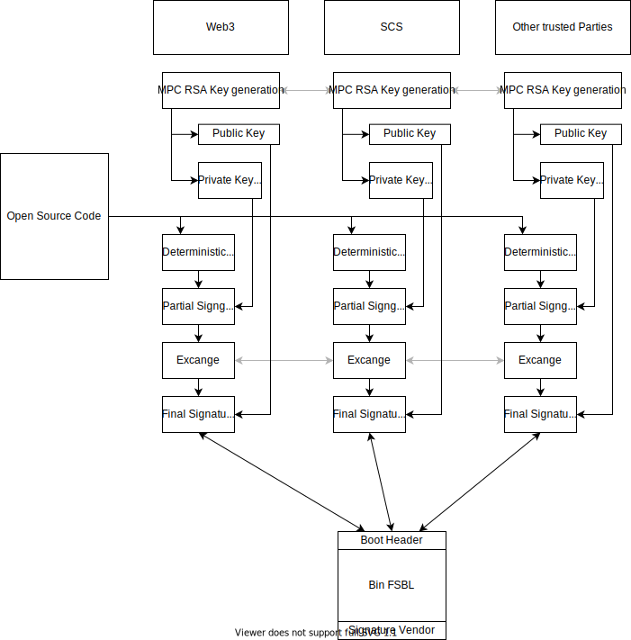
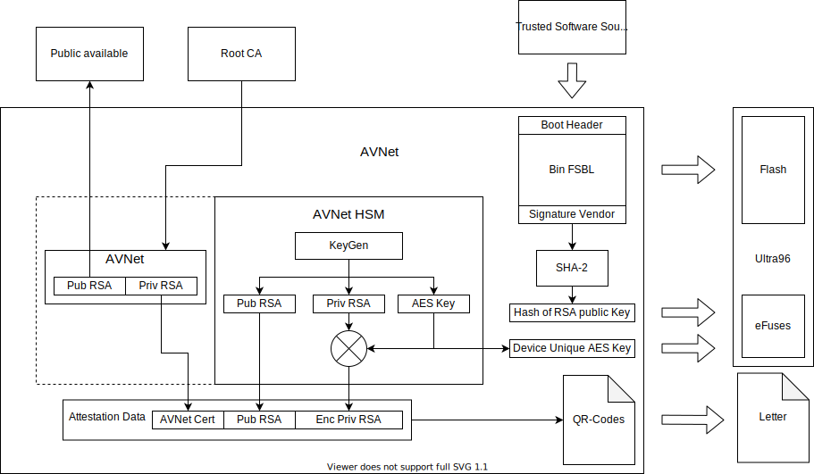
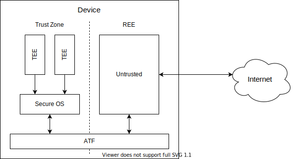

# Distributor-Level Remote Attestation

If manufaturers don't offer remote attestation, the HW distributor could jump in as the second trusted entity in the supply chain.

## Concept
The goal of remote attestation is to enable the verifier to trust a member. The verifier wants to trust the hardware and software, which is physically located at the member's site. The assumption is that the verifier has never accessed the hardware of the member. Therefore, other parties provide a root of trust, which is implanted in the hardware. In the picture below are three other parties, where most important one is the Provision Entity. She is a distributor of hardware and has also the ability to program the devices. So, they take hardware from the official manufacturers and combine it with software from a source, which is trusted by the verifier. Afterwards, this bundle is purchasable by everyone, who wants to participate. In conclusion, if somebody wants to become a member of the service, he has to buy a device from provision entity. These devices are ready to perform remote attestation.

The Verifier is concerned about integrity and confidentiality and requires a proof that:

1.   Member’s hardware is genuine, attested by the provision entity in a manner that the verifier is able to identify devices in the field by secure cryptographic methods
1.   Member’s hardware runs exactly the code as published open source by the Trusted Software Source
1.   Data supplied to the TEE is treated confidentially (fulfilled if all the above holds and the TEE design is trusted)

To fulfill these requirements each role is specified in the following sections.

## Roles

*    Hardware Manufacturer: produces hardware
*    Trusted Software Source: writes open source software that is supposed to be run on TEEs
*    Provision Entity: Distributor with the possibility to provision devices
*    Member: operates TEE hardware on their own premises and always has physical access to it
*    Verifier: wants to run software from the Trusted Software Source with its own confidential data on Member's hardware

### Hardware Manufacturer
The hardware manufacturer has to be trusted.

### Trusted Software Source
To generate an open source flash image, which is signed, is problematic. Because the one who is signing is a new root of trust. Therefore, in this concept this root is spread over a lot of participants to get to an open source like root of trust. The diagram below visualizes our approach. On the left side is the open source code visible for everyone. Everything that follows is constructed under the assumption that the parties have established secure communication channels. All parties (Web3, SCS, ...) collaborate in the Multi-Party-Computation (MPC) RSA generation (better source is needed). As a result, everyone receives the public key and a part of the private key. Therefore, they can only together generate a signature. This is used to build a binary that only can be signed by all parties together. They take the source code and build it deterministically. Afterwards, they sign the hash of their binary and exchange it with each other. Then, they check the hash in the others signatures, if the hashes are correct, the combine the signatures to the final signature. This signature can be verified with the public key. With this protocol everybody can build the binary and verify it, which leads to the following assumptions:

*   All parties are involved in a signature
*    Together they are the root of trust, therefore they should be independent organizations

### Provision Entity
To explain the role of the Provision Entity an example with AVNet is given. AVNet receives two things from the trusted software source, the binary flash image and the eFuse configuration. The eFuses ensures that only singned software can boot. The hardware manufacturer delivers the hardware. In this approach an AVNet Ultra96 is used. This board features a Xilinx Ultrascale+ MPSoC, which has some essential security features built-in. To fulfill the requirements AVNet has to burn the eFuses with the correct Values and load the Flash with the image. Also, with every Ultra96 a letter should be shipped. This letter contains the data set needed to perform a remote attestation. To write the data to the letter, QR-Codes could be used. Furthermore, to generate the attestation data a HSM is necessary. The HSM has to generate two different keys. At first it needs an RSA keypair, where the public key is written directly to the attestation data set. Secondly, the HSM generates a AES-256 key, which is then used to encrypt the private RSA key. This encrypted RSA key is then written to the attestation data. After the encryption the AES-256 key is burnt into the eFuses. Afterwards, all the keys have to be forgotten by AVNet. To complete the attestation data, AVNet has to sign the public RSA key and the encrypted private RSA key. This is done with an AVNet specific private RSA key. The public part of this key has to be made public available for everyone to access it. After this process, these assumptions can be made:

*    AVNet has burnt the eFuses in a way that only signed software can boot
*    The only bootable software comes from the trusted software source
*    AVNet has burnt a AES-256 key into the eFuses, which is not extractable
*    Nobody knows the AES-256 key anymore
*    Nobody can decrypt the private RSA key, execpt the matching hardware
*    The public RSA key, which is public available, can be used to verify an attestation data set

### Member
The member buys a device from the provision entity. This device can only boot from signed images, which performs a secure boot with the image from the flash. This image sets up a system, that is split in two halves. In on half starts a rich OS, which is considered untrusted. In the other half starts a secure OS. This half is protected from the other side with ARM Trust Zone. After the setup, a trusted computing base is established. Due to the fact, that the secure OS inside the trust zone, it can enforce every restriction we like. Furthermore, the member receives a letter, which contains the attestation data. The member has to feed this data manually into the system.

### Verifier
To perform an actual remote attestation, the verifier needs at first the public key from the PE. Then the verifier sends a request to the Member. He answers with the attestation data, which contains the public RSA key from his own keypair. Also, the encrypted private key is in the request, the verifier does not need this key, but he needs it to verify the signature of the whole attestation data. At last, there is the signature from the PE in the request. The verifier checks this signature with the public key from the PE. Afterward, he constructs a challenge, which is in the simplest case a random number. This random number has to be signed by the member with his own private key. The verifier sends it back to the Member and waits for the response. The member decrypts his private RSA key and uses it to sign the random number. Then the member sends the signature back. The verifier is able to check this signature with the public key, which he received in the request. If the signature is valid, the following statements can be made:

1.    The member owns hardware, which is capable of decrypting the private key
1.    Therefore he owns hardware, which is provisioned by the provision Entity.
1.    Therefore the hardware runs a image, which is signed by the trusted software source.
1.    Therefore the software/hardware are runnig trusted TEEs, which provides confidentially

To refer back to the beginning, with statement 2 is requirement 1 fullfiled and statement 3 fulfils the 2nd requirement. Finally, statement 4 fulfils requirement 3.

