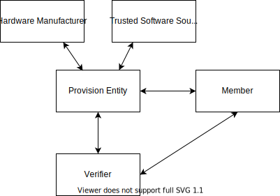
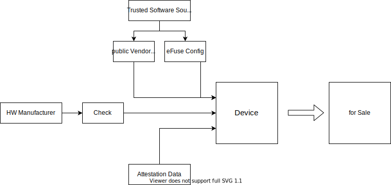

# Distributor-Level Remote Attestation

If manufaturers don't offer remote attestation, the HW distributor could jump in as the second trusted entity in the supply chain.

## Concept
The goal of remote attestation is to enable the verifier to trust a member. The verifier wants to trust the hardware and software, which is physically at the member's site. The assumption is that the verifier has never accessed the hardware of the member. Therefore, other parties offer a root of trust, which is implanted in the hardware. In the picture below are three other parties, where most important one is the Provision Entity. She is a distributor of hardware and has also the ability to program the devices. So, they take hardware from the official manufacturers and combine it with software from a source, which is trusted by the verifier. Afterwards, this bundle is purchasable by everyone, who wants to participate. In conclusion, if somebody wants to become a member of the service, he has to buy a device from provision entity. These devices are ready to perform remote attestation.

The Verifier is concerned about integrity and confidentiality and requires a proof that:

1.   Member’s hardware is genuine, attested by the provision entity in a manner that the verifier is able to identify devices in the field by secure cryptographic methods
1.   Member’s hardware runs exactly the code as published open source by the Trusted Software Source
1.   Data supplied to the TEE is treated confidentially 

To fulfill these requirements each role is specified in the following sections.

## Roles

*    Hardware Manufacturer: produces hardware
*    Trusted Software Source: writes open source software that is supposed to be run on TEEs
*    Provision Entity: Distributor with the possibility to provision devices
*    Member: operates TEE hardware on their own premises and always has physical access to it
*    Verifier: wants to run software from the Trusted Software Source with its own confidential data on Member's hardware

### Hardware Manufacturer
The hardware manufacturer has to be trusted.

### Trusted Software Source
To generate an open source flash image, which is signed, is problematic. Because the one who is signing is a new root of trust. Therefore, in this concept this root is spread over a lot of participants to get to an open source like root of trust. Therefore the parties should be as independent as possible. The diagram below visualizes our approach. On the left side is the open source code visible for everyone. Everything that follows is constructed under the assumption that the parties have established secure communication channels. All parties (Web3, SCS, ...) collaborate in the Multi-Party-Computation (MPC) RSA generation. As a result, everyone receives the public key and a part of the private key. Therefore, they can only together generate a signature. This is used to build a binary that only can be signed by all parties together. They take the source code and build it deterministically. Afterwards, they sign their binary and exchange it with each other. Then, they check the binaries from the other parties, if they are the same, they combine the signatures to the final signature. This signature can be verified with the public key. With this protocol everybody can build the binary and verify it, which leads to the following assumptions:

*   All parties are involved in a signature
*   Together they are the root of trust

### Provision Entity

The provision entity has the task to prepare the devices for remote attestation. This makes her to the main root of trust. Therefore she has to be trustworthy and she also needs appropriate hardware. Which means that she needs at least HSM (Hardware Security Module). Better she has an access authorisation system for the facilities.To provision devices, the provision entity has to execute the following steps.

* Get hardware from  the hardware manufacturer
* Get the software from the trusted software source 
* Check the hardware and the software 
* Enable secure boot
* Generate the attestation data
* Sell the devices publicly

The first two steps are obvious. Get the hard and software from the corresponding sources. The next step is important. The provision entity has to check, if the hardware is not tampered. Because later, with her signature, she states that the hardware is trustworthy.

The next step is to enable secure boot. This means that the provision entity takes the public key from the trusted software source (the one generated in the MPC process) burn it into the devices. Also eFuses are burnt to harden the device. This step is hardware dependent. In some devices only the hash of this public key is burnt in, but its enough to enable secure boot. In the literature this key is often referred as the vendor key.

Afterwards, the attestation data is made. The provision entity generates with the HSM a per device unique key pair. This key pair is called the Attestation Identifier Key, because it is used to identify the device for attestation. Then also a device unique key called Endorsement Key (EK) is used. The origin of this key is hardware dependent. In some devices this key is already embedded in the device. And in others the key can be chosen and written to OTP (One Time Programmable Memory). Where it is impossible to read it back and only accessible through the on chip crypto engine. The EK is then used to encrypt the private part of the AIK. Then the public AIK and the encrypted private AIK are signed with the Provision Entity Key (PE-Key). These three parts form the attestation data.

The PE-Key is certified by a root CA and the public part of this key has to be publicly available. The verifier later needs this key.

The attestation data is added to the device. Because the attestation data is not confidential. It can be saved anywhere on the device.

Another important point is that the provision entity has to guarantee that she forget the EK and the AIK. In some devices the provision entity has never access to the EK. This is good nor bad, because it just shifts trust from the provision entity to the hardware manufacturer.

The last step is to sell the provisioned devices to people who want to operate the hardware. They are called members, because they can become a part of the network.

### Member
The member buys a device from the provision entity. This device can only boot from signed images, which are signed by the trusted software source. These images then perform a secure boot. This image sets up a system, that is split in two halves. In one half starts a rich OS, which is considered untrusted. In the other half starts a secure OS. This half is protected from the other side with ARM Trust Zone. The secure OS such as OPTEE, is able to host different TEEs in parallel and ensures encapsulation of these TEEs.

### Verifier

To do an actual remote attestation, the verifier needs at first the public key from the provision entity. Then the verifier waits on request from the Member. When he wants to join, he send his request, the attestation data. The verifier then validates the attestation data. If the data is valid, he knows the public AKI. To validate the public AIK, he generates a challenge. The simplest challenge is a random number. This number is sent to the member. The member decrypts the private AIK and signs the random number with it. Afterwards he sends the signature back with some system measurements. The verifier can validate the signature. If the signature is valid, the verifier can make the following assumptions:

1. The private AIK used to forge the signature belongs to the public AIK from the attestation data, therefore there a valid key pair
1. The AIK was generated by the provision entity, because it is signed with the PE-Key
1. The device is a provisioned hardware, because the hardware is the only one which knows the EK and is able to decrypt the private AIK.
1. The hardware has booted a trustful system, because the eFuses were burnt by the provision entity

